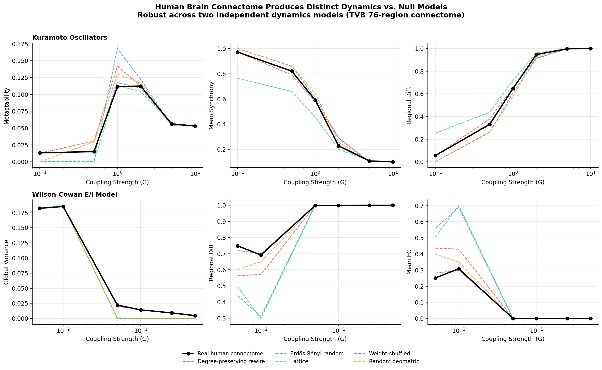
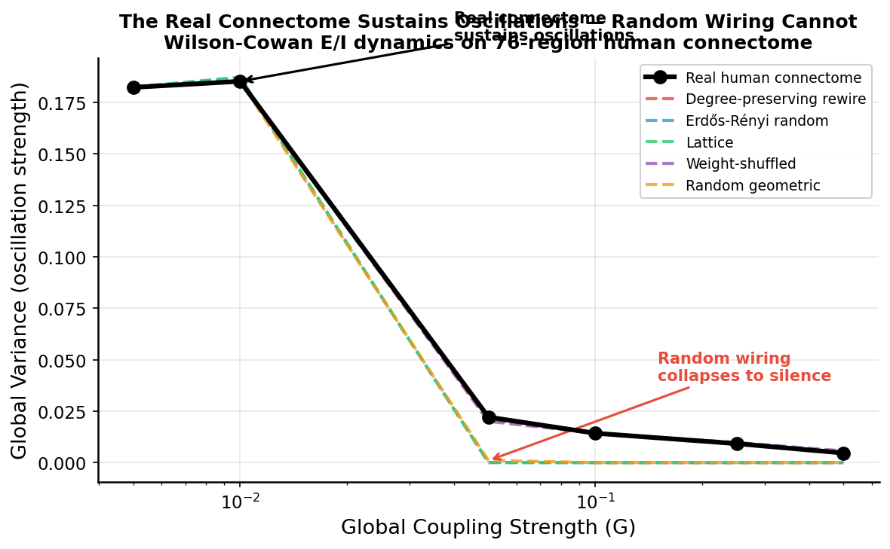

# conntopo

**Does human brain wiring actually matter for neural computation?**

We tested the real [Human Connectome Project](https://www.humanconnectome.org/) data against 5 types of random wiring using **two independent dynamics models** (Kuramoto and Wilson-Cowan). The real connectome produces massively different dynamics — and in one model, **random wiring collapses to silence while the real connectome sustains oscillations.**



*Top row: Kuramoto oscillators. Bottom row: Wilson-Cowan E/I model. Real human connectome (black) vs. 5 null network models. Both models show the real connectome produces distinct dynamics, especially at moderate coupling.*

## Key Findings

### Result 1: The real connectome is dynamically distinct from random wiring
- **Kuramoto:** 111/210 comparisons significant (p<0.05), effect sizes d=5-16
- **Wilson-Cowan:** 48/150 comparisons significant (p<0.05), effect sizes d=2-2422
- **Robust across both models** — not an artifact of model choice

### Result 2: The real connectome sustains oscillations that random wiring cannot



In the Wilson-Cowan model, the real connectome sustains excitatory-inhibitory oscillations (variance=0.02) while Erdős-Rényi, lattice, and random geometric networks **collapse to fixed points** (variance≈0). Effect sizes d>2000. The specific wiring pattern of the human brain is what keeps it oscillating.

### Result 3: It's the specific wiring, not just graph statistics
Even **degree-preserving rewiring** (same number of connections per region, but random targets) produces different dynamics. This means it's not just the hub structure or density — it's the precise connectivity pattern that matters.

### Result 4: The effect peaks at moderate coupling
Both models show the strongest topology-dynamics differences at moderate coupling strengths — the regime corresponding to the brain's operating point near criticality. At very low coupling, regions don't interact enough for topology to matter. At very high coupling, everything synchronizes regardless of wiring.

## Quick Start

```bash
pip install conntopo
python -m conntopo  # Run demo (~60 seconds)
```

```python
from conntopo.connectome import Connectome
from conntopo.dynamics import KuramotoModel
from conntopo.nullmodels import generate_null_ensemble
from conntopo.analysis.metrics import compute_all_metrics

# Load real human brain connectome (76 regions, 1560 connections)
brain = Connectome.from_bundled("tvb76")

# Simulate Kuramoto oscillators on the real connectome
model = KuramotoModel(brain.weights, global_coupling=1.0)
result = model.simulate(duration=5000, dt=0.1, transient=1000, seed=42)
real_metrics = compute_all_metrics(result, model_type="kuramoto")

# Compare against random wiring
nulls = generate_null_ensemble(brain, "erdos_renyi", n_instances=20, seed=42)
null_metrics = []
for null_conn in nulls:
    m = KuramotoModel(null_conn.weights, global_coupling=1.0)
    r = m.simulate(duration=5000, dt=0.1, transient=1000, seed=42)
    null_metrics.append(compute_all_metrics(r, model_type="kuramoto"))

print(f"Real metastability:  {real_metrics['metastability']:.4f}")
print(f"Null metastability:  {sum(m['metastability'] for m in null_metrics)/len(null_metrics):.4f}")
```

## Reproduce the Full Experiment

```bash
git clone https://github.com/toroleapinc/conntopo.git
cd conntopo
pip install -e ".[dev]"

# Run both experiments (~20 min each)
python experiments/01_spontaneous_dynamics.py --model kuramoto
python experiments/01_spontaneous_dynamics.py --model wilson_cowan

# Generate all figures
python scripts/generate_hero_figure.py
```

## Methodology

### Null Models

We compare the real connectome against 5 null network types, each controlling for different properties:

| Null Model | Preserves | Destroys |
|---|---|---|
| **Degree-preserving rewire** | Degree distribution | Clustering, modularity, rich-club |
| **Erdős-Rényi random** | Edge density | All structure |
| **Random geometric** | Spatial embedding | Non-spatial topology |
| **Lattice** | Node/edge count | All heterogeneity |
| **Weight-shuffled** | Binary topology | Weight-topology correlations |

### Dynamics Models

- **Kuramoto oscillators** — phase coupling model, standard for studying synchronization
- **Wilson-Cowan** — excitatory-inhibitory population model, captures oscillatory E/I dynamics

### Statistical Analysis

- Mann-Whitney U tests (non-parametric) for each metric × null type comparison
- Cohen's d effect sizes
- 20 null model instances per type, 5 trials per condition
- 6 coupling strengths per model spanning subcritical to supercritical regimes

## Why This Matters

The [Drosophila connectome study](https://www.nature.com/articles/s41586-024-07939-3) (Lappalainen et al., Nature 2024) showed that neural wiring predicts function at the single-neuron level in fruit flies. We extend this question to the **human macro-connectome**: does the large-scale wiring architecture of the human brain — its modular hierarchy, rich-club hubs, and small-world topology — actively shape the dynamics of neural computation?

**The answer is yes.** And the effect is not subtle.

## Data

Structural connectivity from [The Virtual Brain](https://www.thevirtualbrain.org/) project, derived from Human Connectome Project diffusion MRI tractography (76 cortical and subcortical regions).

## Citation

If you use conntopo in your research, please cite:

```bibtex
@software{conntopo2026,
  title={conntopo: Does connectome topology shape neural dynamics?},
  author={edvatar},
  year={2026},
  url={https://github.com/toroleapinc/conntopo}
}
```

## License

MIT
